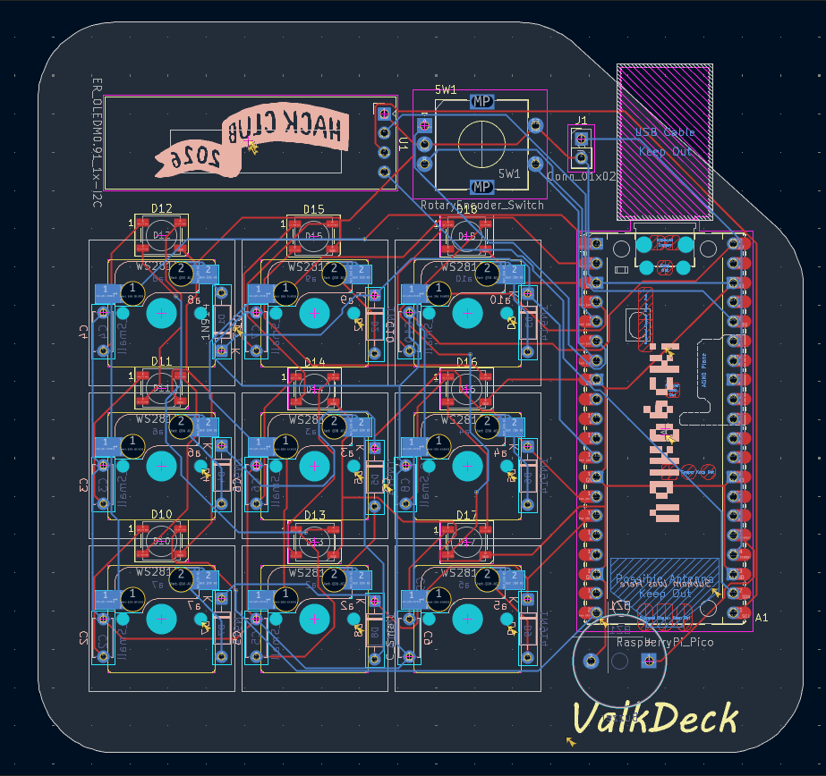
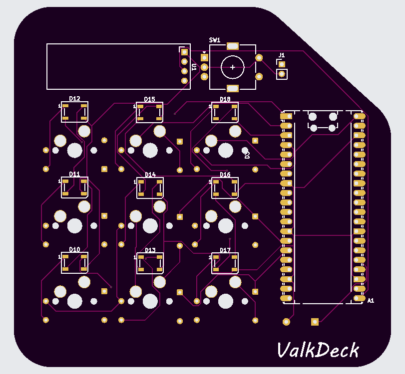
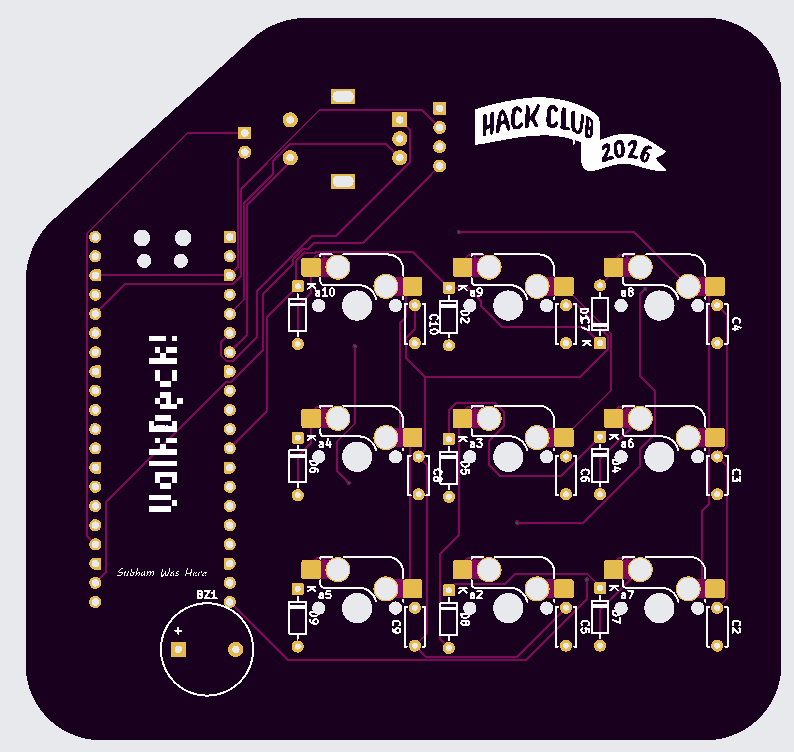
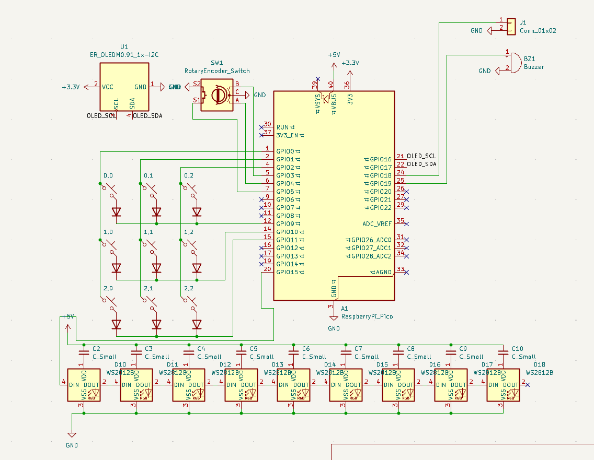
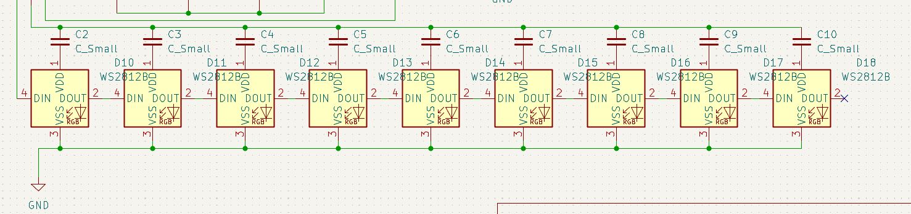
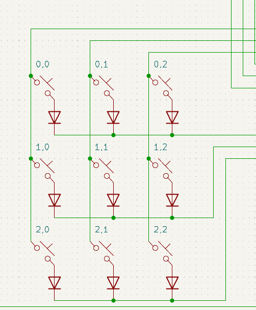
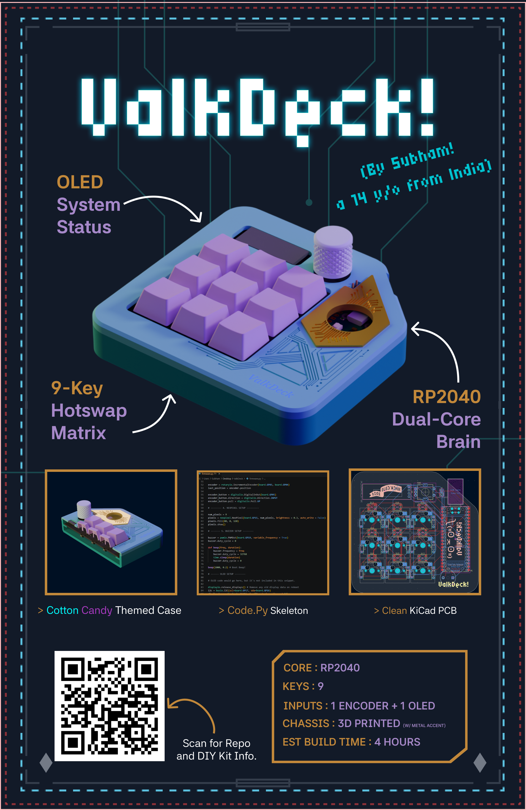

# VALKDECK 

Hey there, I'm Subham, a 14 year old kid (currently) from Chennai, India

I needed a better way to manage my flight sim telemetry, trigered automation workflows, and also blindly control my volume while locked into a game. I could have bought a generic macropad off Amazon for $20.

Instead, I spent 40 hours learning KiCad, routing my own custom PCB, designing an enclosure in onshape, and writing a CircuitPython program from scratch.

Welcome to *ValkDeck.*

It's a 9-key, fully hotswappable cyberdeck module powered by a Raspberry Pi Pico. It features per=key WS2812B underglow, a rotary encoder for media control, and a 0.91" I2C OLED display that feeds back live system status so I can actually know what my macros are doing.

# FEATURE PIVOT

If you look at the top right of the board, you'll see a machined metal blanking plug.

Originally, that 12mm hole was meant for a massive, avionics-grade MTS-101 toggle switch (the "Nuke Switch") to act as a hardware reset. I measured the top plate perfectly. What i *forgot* to measure was the internal Z-axis clearance. The massive rectangular block of the toggle switch slammed right into the PCB.

Physical reality remains undefeated. Instead of spending the next 6 hours rearranging the whole top-case, I pivoted. I covered it with a sleek metal plug for a premium industrial look. It's not a bug; it's an aesthetic hardware change.

# THE PCB

I have been familiar with breadboards and scary jumper wire connections for quite a while. Instead of a terrifying 3D web of hand-soldered jumper wires, ValkDeck runs on a custom-routed, two layer FR-4 board.

Bottom-Mount SMD     : The kailh hotswap sockets and 1N4148 diodes are all surface mounted on the upperside of the board. 
Ghost-Free Matrix    : The diodes are correctly routed (Row to Column) to ensure complete N-key rollover without ghosting.
Through-Hole Anchors : The Raspberry Pi Pico, Rotary Encoder, and OLED screen are all through-hole soldered for maximum regidity 💪.

# HARDWARE

ValkDeck runs on a custom FR-4 PCB with a proper diode-protected switch matrix.

- The Brain   : Raspberry Pi Pico (RP2040)
- The Matrix  : 9x Kailh Hotswap Sockets (with 1N914 diodes pointing Row -> Col)
- The Display : 0.91" SSD1306 OLED (128x32)
- The Input   : 9x Mechanical Switches 
                 1x M274 Rotary Encoder (with push-to-mute)
- The RGB     : 9x WS2812B NeoPixels
- The Alert   : 1x Active Buzzer for audio feedback (and 8 bit pokemon and mario sfx)

# PINOUT ARCHITECTURE

If you're trying to understand the exact tracing or trying to make your very own ValkDeck, here is the routing:

| Component         | Pico Pin (GPIO)                              | Note                            |
| :---------------- | :------------------------------------------: | ------------------------------: |
| Matrix Rows       | GP09, GP10, GP11                             | Row 0,1,2                       |
| Matrix Cols       | GP00, GP01, GP02                             | Col 0,1,2                       |
| Encoder           | GP04(A), GP03(B), GND(C), GND(S2), GP05(S1)  | Volume sweeping and mute        |
| OLED              | GP16(SCL), GP17(SDA)                         | Standard I2C                    |
| NeoPixels         | GP15                                         | Single data line for all 9 LEDs | 
| Buzzer            | GP19                                         | PWM Audio (retro pokemon)       |

# RUNNING THE FIRMWARE

ValkBlox is run using Adafruit's CircuitPython. It uses the keypad library for the background matrix scanning, and displayio to dynamically update the OLED based on what macro you just fired

To Deploy : 

- Flash your Pico with the latest [CircuitPython.uf2](https://learn.adafruit.com/welcome-to-circuitpython/installing-circuitpython) 

- Grab the [Adafruit Library Bundle](https://github.com/adafruit/Adafruit_CircuitPython_Bundle) and drop this stuff into your CITCUITPY/lip folder
  - adafruit_hid
  - adafruit_displayio_ssd1306.mpy
  - adafruit_display_text
  - neopixel.mpy

- Drop firmware.py from this repo to the root drive

# BOM (Bill of materials)
|Name	                                                    |Purpose	                                                    |Quantity	|Total Cost (USD)	|Link	        |Distributor   |
| :------------------------------------------------------ | :---------------------------------------------------------: | ------- | --------------- | ----------- |----------------
|Raspberry Pi PICO                                          |Microcontroller (Controls everything lol)	                    |1	        |$4.05	            |[View Product](https://www.silverlineelectronics.in/products/raspberry-pi-pico?_pos=3&_sid=a84e46afc&_ss=r#)	 |Silverzone   |
|0.91 Inch I2C OLED                                      	|OLED Display to display backend info      	                    |1	        |$1.94	            |[View Product](https://roboticsdna.in/product/0-91-inch-iic-4-pin-oled-display-module-ssd1306-white/)	|RoboticsDNA   |
|Cherry MX RGB Switch	                                    |Brown RBG Switch (Pack of 10)                               	|1	        |$3.7	            |[View Product](https://meckeys.com/shop/accessories/keyboard-accessories/key-switches/cherry-mx-rgb-switch/?attribute_pa_cherry-mx=brown-rgb)	|Meckeys   |
|Kalih Socket                                               |Hot-Swap socket for cherry mx switches (Pack of 10)            |1	        |$0.84	            |[View Product](https://meckeys.com/shop/accessories/keyboard-accessories/key-switches/kailh-hot-swap-socket/)	|Meckeys   |
|Deep Purple Keycaps                                        |Purple Keycaps (Pack of 5)                                     |2	        |$2.00	            |[View Product](https://meckeys.com/shop/accessories/keyboard-accessories/keycaps/blank-dsa-keycaps-1u/?attribute_pa_variations=deep-purple)	|Meckeys   |
|Rotary Encoder            	                                |M274 Rotary Encoder Switch                                     |1	        |$0.46	            |[View Product](https://robu.in/product/m274-360-degree-rotary-encoder-module-brick-sensor)	|Robu   |
|rotary encoder knob           	                            |3D printed                                                     |1	        |----	            |-----       	|-----   |
|100nF capacitor           	                                |100nF ceramic capacitor (Pack of 25)                           |1	        |$0.15	            |[View Product](https://roboticsdna.in/product/0-1-uf-ceramic-capacitor-10-pieces/)	|roboticsDNA   |
|1N4148 Diode                                               |IN4148 DIODE (Pack of 10)                                      |2	        |$0.50              |[View Product](https://roboticsdna.in/product/diode-1n4148/)	|RoboticsDNA   |
|WS2812B RGB                    	                        |WS2812B 5050RGB (Pack of 10)                                   |1	        |$2.43	            |[View Product](https://robu.in/product/ws2812b-rgb-addressable-led-module)	|Robu   |
|AC1255 Buzzer           	                                |Buzzer                                                         |1	        |$0.074	            |[View Product](https://robu.in/product/ac1255-cldz-piezoelectric-passive-buzzer-1-25v12x5-5mm)	|Robu   |
|2.54mm male header          	                            |Male header for PICO                                           |2          |$0.55	            |[View Product](https://robu.in/product/ds1029-01-1x40p8bva1-b-connfly-1x40-pin-2-54mm-pin-header-single-row-stack-v-t-type)	|Robu   |
|Custom PCB                                           	 |Custom PCB printed from JLCPCB (includes shipping)                   |5	        |$9.20	            |[View Product](https://www.silverlineelectronics.in/products/raspberry-pi-pico?_pos=3&_sid=a84e46afc&_ss=r#)	 |Silverzone   |
|Total                      	                            |-----                                                          |0          |$25.82            |-----      	|-----   |

(ps. this repo will be updated to v1.1 after i build this board irl, stay tuned! :3)

